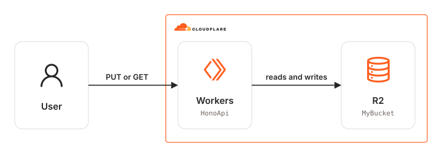

# sst-cloudflare-hono-api

SST app that deploys a Hono API to Cloudflare.

## Architecture Diagram

<picture>
  <source media="(prefers-color-scheme: dark)" srcset="./assets/arch-diagram-dark.svg">
  
</picture>

## Prerequisites

- **_Cloudflare:_**
  - Must have set the `CLOUDFLARE_API_TOKEN` variable in your local environment, with the `Workers Scripts:Edit`, `Workers R2 Storage:Edit` and `Account Settings:Read` permissions.
- **_mise:_**
  - [Install mise](https://mise.jdx.dev/installing-mise.html), which manages Node and pnpm.

## Installation

```sh
mise install
pnpm install
```

## Deployment

```sh
pnpm sst deploy
```

## Usage

1. Grab the `<WORKER_ROUTE_URL>` from the deployment outputs:

   ```sh
   ✔  Complete
      url: <WORKER_ROUTE_URL>
   ```

2. Upload the `package.json` to the R2 bucket using your Hono API endpoint:

   ```sh
   curl -H "Content-Type: application/json" -T "package.json" <WORKER_ROUTE_URL>
   ```

3. Navigate to `<WORKER_ROUTE_URL>` to see the uploaded `package.json` file.

## Cleanup

```sh
pnpm sst remove
```
